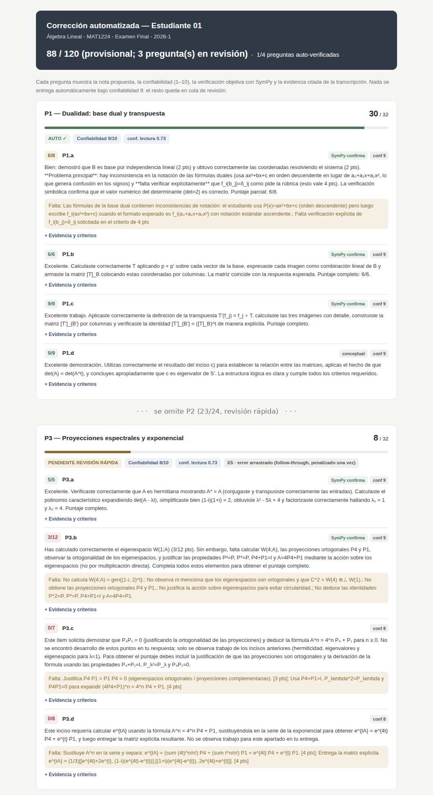

# Corrección automatizada de exámenes manuscritos — blueprint del modelo

**Proyecto GRADING TEST** · Caso experimental: examen final MAT1224 Álgebra Lineal (2026-1) · Julio 2026
Estado: 7 fases implementadas y operativas · 76 tests automatizados · piloto de calibración en curso

---

## 1 · Punto de partida

La alternativa simple existe: escanear el examen, subir el PDF a un modelo de lenguaje
(LLM) y pedirle "corrige con esta pauta". El modelo devuelve en un minuto un 78/120 con
comentarios plausibles. Ese número, sin embargo, no viene con garantías: no hay forma de
saber si el modelo leyó bien la caligrafía, si aplicó la pauta o improvisó criterios, ni
si en otra corrida devolvería 71 u 84.

El sistema descrito aquí parte de esa limitación. No consiste en que "un LLM corrige",
sino en una arquitectura donde el LLM propone, la matemática verifica y el humano decide
los casos dudosos. El criterio de diseño central: cuando el sistema no puede leer o
calificar con garantías, lo declara y deriva el caso a revisión humana, en lugar de
entregar una nota de todos modos.

El caso experimental: examen final de 120 pts (4 preguntas, 15 ítems: dualidad, espacios
cociente, proyecciones espectrales, formas de Jordan), manuscrito libre de 12 páginas
donde el estudiante rotula "Ejercicio N" a mano, empieza a mitad de página y retoma
ejercicios varias páginas después ("continuación 2b"). De los 15 ítems, 9 son
verificables simbólicamente (un cálculo reproduce el solucionario) y 6 son conceptuales
(demostraciones).

## 2 · Limitaciones del enfoque directo y cómo se abordan

El diseño responde a siete problemas concretos del enfoque directo; varios quedaron
ilustrados con casos del piloto.

**1. Errores de lectura.** El modelo puede leer "6λ" donde el manuscrito dice "5λ" y
construir sobre esa lectura un descuento bien argumentado (el fenómeno se conoce como
alucinación). Se aborda con dos lecturas independientes de la misma imagen por modelos de
proveedores distintos (Claude y Gemini), que tienden a equivocarse en cosas distintas; con
un reintento sobre la versión en escala de grises cuando la primera lectura sale mal; y
con la verificación simbólica de los resultados. Caso del piloto: una corrida transcribió
mal un polinomio; las dos lecturas independientes coincidieron después en la versión
correcta y el ítem pasó de un descuento de 3 puntos a coincidir con el corrector humano.

**2. No distingue "no pude leer" de "no respondió".** Para el modelo ambos casos son
"nada que calificar"; para el estudiante la diferencia es la nota. El pipeline mide
legibilidad y cobertura de cada respuesta y, bajo el umbral, emite la excepción E1: el
ítem no se califica y el reporte lo indica en forma explícita ("no implica pregunta en
blanco").

**3. Criterios de corrección propios.** Sin restricciones, el modelo corrige con
criterios razonables pero ajenos a la pauta del curso. Aquí la rúbrica es cerrada: solo
puede aplicar las penalizaciones listadas, con su valor exacto, y las notas globales fijan
que las respuestas equivalentes valen puntaje completo y que un error arrastrado se
penaliza una sola vez. Caso del piloto: el corrector automático penalizaba una forma de
Jordan obtenida por un camino alternativo válido (vía nulidades) hasta que las notas
globales de la rúbrica se incorporaron a la instrucción del modelo.

**4. Ausencia de una medida de confianza.** El modelo responde con la misma soltura
cuando está seguro y cuando no. Cada ítem recibe por eso un score de confiabilidad (1–10)
compuesto por seis señales medibles: calidad de lectura, autoconfianza de la corrección,
verificación simbólica, cobertura de la rúbrica, consistencia y ausencia de banderas.
Nada se entrega automáticamente bajo score 9; el resto pasa a colas de revisión humana, y
la cola automática se audita al azar (10 %).

**5. Falta de trazabilidad.** Un "78/120" sin respaldo es difícil de defender ante un
recorrigido. Aquí cada punto otorgado o descontado cita evidencia textual de la
transcripción; cada estudiante recibe un reporte navegable (§4) y 14 códigos de excepción
(E1–E14) documentan por qué algo fue a revisión.

**6. Variabilidad entre corridas.** La misma entrada puede producir notas distintas. Se
aborda con una rúbrica de desgloses exactos (calibrados contra corrección humana), salida
en JSON validado con reintento si el formato falla (y si aun así falla, excepción E14: el
ítem no queda en banda automática), y la verificación simbólica, que fija los resultados
calculables: esa parte de la nota no depende de la corrida.

**7. Límites técnicos de las APIs.** Las APIs rechazan imágenes de más de 8000 px de
lado, cortan respuestas largas y se sobrecargan en horario punta. El pipeline trocea las
regiones altas de imagen, usa topes de tokens holgados, reintenta con esperas crecientes
(*backoff*) y guarda el estado de avance por estudiante-ítem en una base de datos local:
un error de servidor a mitad del lote no pierde el trabajo ya hecho y la corrida se
reanuda donde quedó.

## 3 · El pipeline

Estos componentes se organizan en siete fases:

```
             escaneo PDF (300 dpi, un archivo por estudiante)
                                 │
                                 ▼
  ┌──────────────────────────────────────────────────────────────┐
  │ F0 · PREPROCESO Y SEGMENTACIÓN                             ● │
  │ PDF → imágenes · versión gris (CLAHE) y binarizada ·         │
  │ enderezado · segmentación por contenido: el modelo de visión │
  │ recibe las descripciones de la rúbrica y ubica dónde empieza │
  │ cada ejercicio por su matemática (robusto a continuaciones)  │
  └──────────────────────────────────────────────────────────────┘
                                 │   una región de imagen por pregunta
                                 ▼
  ┌──────────────────────────────────────────────────────────────┐
  │ F1 · TRANSCRIPCIÓN (lecturas en paralelo)                    │
  │  ● Track A   Claude Vision: transcripción fiel — no corrige  │
  │              al estudiante, marca [ilegible]; si la lectura  │
  │              sale mal, reintenta sobre el gris               │
  │  ● Track A'  Gemini: segunda lectura independiente (opcional)│
  │  ○ Track C   Tesseract: texto impreso                        │
  │  ✕ Track B   OCR por fórmula: apagado en manuscrito libre    │
  └──────────────────────────────────────────────────────────────┘
                                 │
                                 ▼
  ┌──────────────────────────────────────────────────────────────┐
  │ F2 · RECONCILIACIÓN                                        ○ │
  │ conf_lectura ∈ [0,1]: legibilidad + acuerdo entre lecturas + │
  │ acuerdo con texto impreso + cobertura + calidad de imagen    │
  │ conf < 0.6 → E1 (el ítem no se califica automáticamente)     │
  └──────────────────────────────────────────────────────────────┘
                                 │
                                 ▼
  ┌──────────────────────────────────────────────────────────────┐
  │ F3 · CORRECCIÓN (un ítem a la vez)                         ● │
  │ fragmento de rúbrica + notas globales + resultado SymPy      │
  │ previo ○ como evidencia · cita textual obligatoria · solo    │
  │ penalizaciones de la pauta · resultado sin justificación =   │
  │ crédito leve · salida JSON validada (si no parsea → E14)     │
  └──────────────────────────────────────────────────────────────┘
                                 │
                                 ▼
  ┌──────────────────────────────────────────────────────────────┐
  │ F4 · VERIFICACIÓN SIMBÓLICA                                ○ │
  │ SymPy ejecuta los snippets de la rúbrica → resultado         │
  │ objetivo · contradicción → E10 (prevalece SymPy) · error     │
  │ arrastrado → E5 (se penaliza una sola vez)                   │
  └──────────────────────────────────────────────────────────────┘
                                 │
                                 ▼
  ┌──────────────────────────────────────────────────────────────┐
  │ F5 · SCORE DE CONFIABILIDAD (1–10 por ítem)                ○ │
  │ 6 componentes: lectura · autoconfianza de la corrección ·    │
  │ SymPy · cobertura de rúbrica · consistencia · banderas       │
  │ score de la pregunta = mínimo de sus ítems                   │
  └──────────────────────────────────────────────────────────────┘
                                 │
                                 ▼
  ┌──────────────────────────────────────────────────────────────┐
  │ F6 · SALIDAS                                               ○ │
  │ reporte auditable por estudiante (.md y .html con fórmulas   │
  │ renderizadas) · fichas por pregunta en tres colas            │
  └──────────────────────────────────────────────────────────────┘
                                 │
          ┌──────────────────────┼───────────────────────┐
          ▼                      ▼                       ▼
   ┌─────────────┐       ┌──────────────┐        ┌───────────────┐
   │    AUTO     │       │   REVISIÓN   │        │   REVISIÓN    │
   │  score ≥ 9  │       │ RÁPIDA (7–8) │        │ COMPLETA (<7) │
   └─────────────┘       └──────────────┘        └───────────────┘
          │
          ▼
   auditoría humana aleatoria del 10 % de la cola AUTO

  Leyenda:  ● llamada a un LLM        ○ paso determinístico (código
            ✕ desactivado               local, sin modelos: mismo
            E# código de excepción      resultado en cada corrida)
```

El pipeline termina asignando cada pregunta a una de tres bandas, según su score de
confiabilidad. La banda determina cuánta revisión humana se exige antes de aceptar la
nota; en los tres casos la nota propuesta, la evidencia y la verificación ya están
calculadas.

- **AUTO (score ≥ 9).** La nota propuesta se acepta sin revisión individual. Como
  control, un 10 % de esta cola, elegido al azar, se revisa de todos modos; la meta del
  piloto (≥98 % de acuerdo con el corrector humano) se mide sobre esta banda.
- **Revisión rápida (score 7–8).** La lectura y la corrección son en general confiables,
  pero alguna señal quedó bajo el umbral (por ejemplo, un acuerdo de lecturas justo o un
  ítem sin confirmación simbólica). El corrector verifica los puntos señalados en la
  ficha y acepta o ajusta la nota; no recorrige desde cero.
- **Revisión completa (score < 7).** El sistema no puede garantizar su propuesta:
  ilegibilidad, contradicción con la verificación simbólica, contenido que no corresponde
  al ítem u otra excepción registrada. El corrector corrige la pregunta como lo haría
  normalmente, con la transcripción y la evidencia como apoyo.

Los códigos de excepción mencionados en este documento (la lista completa llega a E14):

| Código | Significado |
|---|---|
| E1 | Lectura poco confiable (legibilidad o cobertura bajo el umbral): el ítem no se califica automáticamente |
| E5 | Error arrastrado detectado: se penaliza una sola vez, en el ítem donde se originó; los pasos posteriores se evalúan a partir del valor arrastrado |
| E10 | El desarrollo del estudiante contradice el resultado de SymPy: prevalece SymPy y el ítem va a revisión |
| E14 | La respuesta del modelo corrector no llegó en el formato esperado tras reintentar: el ítem no queda en banda automática |

La orquestación es reanudable (estado por estudiante-ítem en SQLite), permite re-correr
estudiantes puntuales y todas las llamadas a APIs reintentan con backoff ante errores de
servidor. Si un componente opcional no está disponible (Tesseract no instalado, la API de
la segunda lectura falla), el pipeline no se detiene: continúa sin ese componente y deja
registrado que esa señal faltó; el score de confiabilidad lo refleja.

## 4 · La salida: el reporte por estudiante

La figura muestra un extracto real del piloto (Fase 6, versión HTML). Por pregunta: nota
propuesta, banda asignada (AUTO o revisión), confiabilidad y confianza de lectura. Por
ítem: puntaje contra la rúbrica, comentario, lo que falta según la pauta, y un panel
plegable con la evidencia citada de la transcripción, los criterios cumplidos y el
resultado de SymPy. Las fórmulas se renderizan con MathJax. El extracto muestra dos
destinos distintos: P1 quedó en banda AUTO (confiabilidad 9/10, tres ítems confirmados
por SymPy); P3 quedó en cola de revisión rápida, con la excepción E5 registrada (error
arrastrado) y dos ítems en 0 puntos donde no se encontró desarrollo, cada uno con el
detalle de lo que falta según la pauta. Esa separación es la que organiza el trabajo del
corrector. El reporte completo del que proviene el extracto está disponible en este
repositorio: [`ejemplo_estudiante_01.html`](ejemplo_estudiante_01.html).



## 5 · Resultados del piloto

La referencia son 3 exámenes reales corregidos a mano; la comparación es un experimento de
calibración, no una fase del pipeline.

- **Piloto inicial:** sesgo de −1.24 pts/ítem (el sistema era más estricto que el
  corrector humano), error absoluto medio 1.44 pts, 45 % de acuerdo exacto por ítem. Las
  diferencias eran de criterio, no de lectura: la transcripción de la caligrafía resultó
  esencialmente correcta.
- **Tras la calibración** (notas globales en la instrucción, SymPy como evidencia previa,
  política de justificación explícita, reintento en gris, rúbrica más desglosada): 10 de
  15 ítems con acuerdo exacto en el examen piloto; la pregunta 1 completa en banda AUTO
  coincidiendo con el humano. Los deltas restantes son deliberados — responden a la
  política del curso ("debidamente justificados": resultado correcto sin pasos = crédito
  leve) — o quedaron fijados en la rúbrica al detectarse.
- **Acuerdo entre lecturas** Claude↔Gemini: 0.76–0.80 (umbral de alarma 0.70), sin falsas
  alarmas tras calibrar la métrica con pares reales.
- **Meta del piloto completo** (15–20 exámenes): ≥98 % de acuerdo en la banda AUTO.

## 6 · Modelos y costos

| Componente | Rol | Nota |
|---|---|---|
| Claude Sonnet (API Anthropic) | Segmentación, transcripción principal, corrección | Única fuente de la nota propuesta |
| Gemini flash-lite (API Google) | Segunda lectura independiente | Solo alimenta la confianza; nunca aporta contenido a la nota. Proveedor distinto ⇒ errores no correlacionados |
| SymPy (local) | Verificación objetiva de los 9 ítems calculables | Determinístico y gratis |
| Tesseract (local) | Texto impreso del enunciado | Opcional; si falta, el pipeline sigue sin esa señal |
| Pix2Text / TexTeller | OCR por fórmula (Track B) | Apagado en manuscrito libre; reactivable con hojas de respuesta estructuradas |

Costo estimado (orden de magnitud, julio 2026): **US$1–2 por examen** de 12 páginas
(~12 llamadas de segmentación, 4–6 transcripciones, 15 correcciones; dominado por Claude —
la segunda lectura con Gemini cuesta menos de US$0.05). Un curso de 40 alumnos: US$40–80
por examen final completo, contra las horas-ayudante de la corrección manual. La revisión
humana no desaparece: se concentra en las colas de revisión y en la auditoría de la cola
AUTO.

Nota de privacidad: usar los niveles pagados de las APIs — los gratuitos pueden usar los
datos para entrenamiento y los exámenes contienen nombre y RUT. Alternativa futura para
privacidad estricta: segunda lectura con modelos abiertos ejecutados localmente
(Gemma, Qwen).

## 7 · Replicación en otro examen

El código no se modifica para otro examen; cambia un solo archivo, la rúbrica.

1. **Escribir la rúbrica JSON** del nuevo examen: criterios de aceptación con puntos,
   errores comunes con penalización exacta, soluciones alternativas, snippets SymPy para
   lo calculable y notas globales. Es la parte que concentra el trabajo académico; el
   resto es configuración.
2. Escaneos a 300 dpi, un archivo por estudiante.
3. Claves de API y ejecutar la orquestación (un comando).
4. **Piloto de calibración recomendado:** corregir a mano 3–5 exámenes, comparar y ajustar
   los desgloses de la rúbrica — no las instrucciones al modelo — donde el corrector
   automático improvise.
5. Mejora futura: hojas de respuesta estructuradas (una caja por ítem), que simplifican la
   segmentación y permiten reactivar el Track B como verificación cruzada adicional.

## Glosario mínimo

- **LLM** (*large language model*): modelo de lenguaje de gran escala (Claude, Gemini, GPT);
  aquí se usan variantes con visión, capaces de leer imágenes.
- **Alucinación**: salida fluida y verosímil pero no fundada en la entrada — p. ej. "leer"
  un símbolo que no está en el manuscrito.
- **OCR** (*optical character recognition*): reconocimiento automático de texto en imágenes.
- **CLAHE**: ecualización adaptativa de contraste; realza trazos débiles del manuscrito
  antes de la lectura.
- **JSON validado**: la respuesta del modelo debe llegar en un formato estructurado fijo y
  se verifica automáticamente; si no cumple, se descarta y se reintenta.
- **Token**: unidad mínima de texto que procesan estos modelos; las APIs cobran y limitan
  por tokens.
- **Backoff**: ante un error transitorio de la API, reintentar con esperas crecientes en
  lugar de fallar de inmediato.
- **Determinístico**: cálculo convencional sin modelos; la misma entrada produce siempre la
  misma salida.

---

*Blueprint del proyecto GRADING TEST · El código del pipeline, la rúbrica de referencia y
los reportes del piloto no están publicados en este repositorio.*
